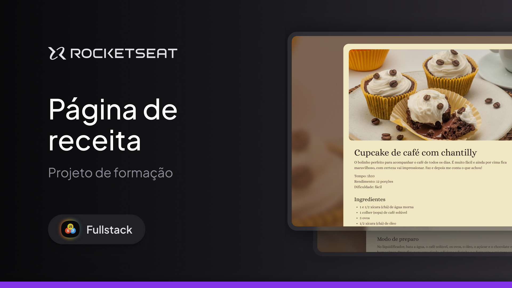

<h1 align="center"> Página de Receita </h1>

Projeto de formação - Página simples de receita de um cupcake de café com chantilly! 🧁

  <a href="#-tecnologias">Tecnologias</a>&nbsp;&nbsp;&nbsp;|&nbsp;&nbsp;&nbsp;
  <a href="#-projeto">Projeto</a>&nbsp;&nbsp;&nbsp;|&nbsp;&nbsp;&nbsp;
  <a href="#-layout">Layout</a>&nbsp;&nbsp;&nbsp;|&nbsp;&nbsp;&nbsp;
  <a href="#memo-licença">Licença</a>

  

 

  

## 🚀 Tecnologias

Esse projeto foi desenvolvido com as seguintes tecnologias:

- HTML e CSS
- Git e Github
- Figma

## 💻 Projeto

Uma página de receita simples de um cupcake de café com chantilly. Contendo informações de tempo, rendimento, dificuldade, ingredientes e modo de preparo. Uma verdadeira delícia!

## 🔖 Layout

Você pode visualizar o layout do projeto através [DESSE LINK](https://www.figma.com/design/Mqv62gtaQGH0b5PA7S2yi9/P%C3%A1gina-de-receita-(Community)?m=auto&t=DlLcfk0hUAKlvLUP-6). É necessário ter conta no [Figma](https://figma.com) para acessá-lo.

## :memo: Licença

Esse projeto está sob a licença MIT.

---

Feito com ♥ by Arthur Costa :wave:
